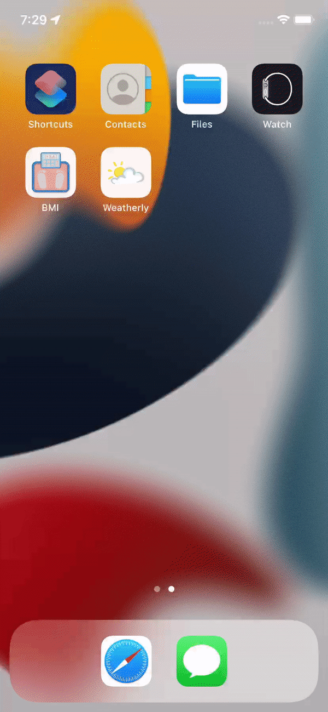

# Weatherly iOS App

This is a simple one-page iOS app written in Swift 5 and designed with Storyboard to search and display current weather.

The app is mainly developed to practice:
- UITextField
- User Input
- Protocols and Delegate 
- APIs (HTTP request and URLSession)
- JSONDecoder
- Closures
- Extensions
- Core Location

## Simulator:

The app is designed to run on:
- iPhone 11
- IOS 15.0
- Portrait Orientation

<h3 align="">

</h3>
